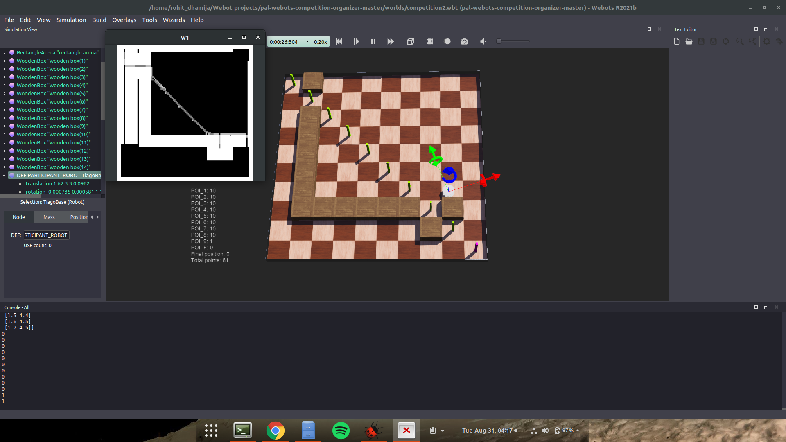

# iros2021challenge-controller-py

This repository is part of the [2021 IROS-RSJ Robotic Challenge for Young Students](https://roboticslab-uc3m.github.io/challenge-iros2021)!

## The Logic
- Our code is divided into 3 modules
  1. Mapping
  2. Planner
  3. Controller
- For Mapping, we used the Lidar Data and plotted it in a 100x100 grid by transforming the points that we get from the lidar (that are wrt the bot), to the world frame
- For the Planner, we have used A-star algorithm. As the bot moves and the map gets updated, we keep generating the path using A-star and give it to the controller to follow
- For the Controller, we have implemented MPC (Model Predictive Control) for path tracking. 

## Visualisation
While mapping the  environment, we also display the location of the bot on the map and the path generated from A-star that it has to follow. 
Following is an image of the same.

## Further Improvements
The bot runs smoothly on some environments, but we still have to tune the controller to be more adaptive towards other scenarios.
